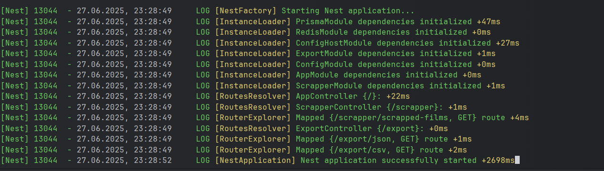
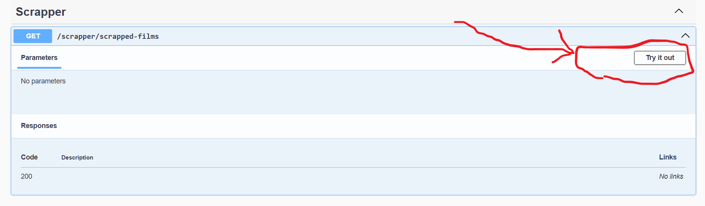
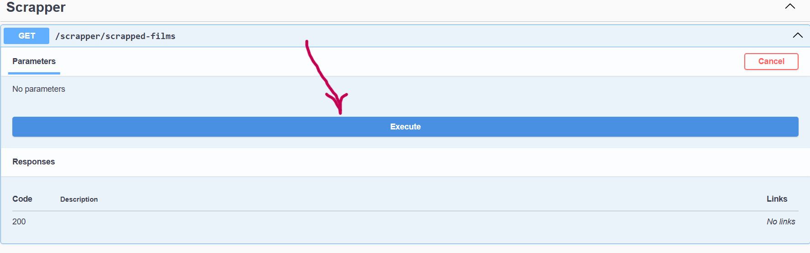
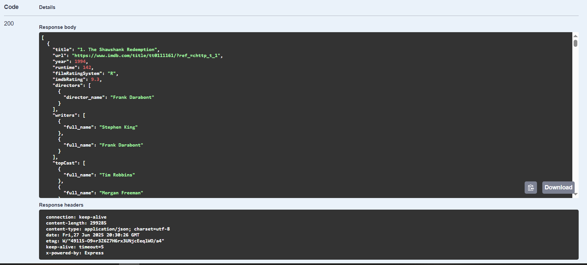
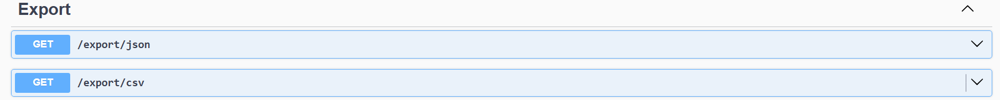

<h1 style="text-align: center">Dokumentacja IMDB Scraper</h1>
Przegląd
IMDB Scraper to zaawansowana aplikacja Node.js zbudowana przy użyciu frameworka NestJS, zaprojektowana do automatycznego pobierania szczegółowych informacji o filmach z serwisu IMDb. Aplikacja przetwarza około 250 najlepiej ocenianych filmów z listy IMDb Top 250 i ekstraktuje kompleksowe dane dla każdego filmu.

<h3>Funkcjonalności
Scraper automatycznie zbiera następujące informacje o filmach:</h3>

## Zbierane dane o filmie

Aplikacja pobiera i zapisuje następujące informacje o każdym filmie:

### Podstawowe informacje o filmie
- **Tytuł** – nazwa filmu
- **Rok wydania** – rok premiery
- **Czas trwania** – w minutach
- **System klasyfikacji wiekowej** (np. R, PG-13)
- **Ocena IMDb** – numeryczna ocena filmu
- **URL IMDb** – bezpośredni link do filmu

### Zespół twórczy
- **Reżyserzy** – lista reżyserów z ich nazwiskami
- **Scenarzyści** – lista scenarzystów z pełnymi nazwiskami

### Obsada
- **Główna obsada** – lista głównych aktorów z pełnymi nazwiskami

### Szczegóły premiery
- **Data premiery** – dokładna data wydania filmu
- **Kraj premiery** – kraj pierwszej premiery

### Języki i kraje produkcji
- **Języki** – lista języków używanych w filmie
- **Kraje pochodzenia** – lista krajów produkcji

### Lokalizacje filmowe
- **Miejsca kręcenia** – konkretne lokalizacje, miasta, kraje gdzie kręcono film

### Firmy produkcyjne
- **Wytwórnie filmowe** – lista firm odpowiedzialnych za produkcję

### Informacje finansowe
- **Budżet** – koszt produkcji w USD
- **Wpływy USA/Kanada** – dochody z rynku północnoamerykańskiego
- **Weekend otwarcia USA/Kanada** – wpływy z pierwszego weekendu
- **Wpływy światowe** – całkowite dochody na świecie

<h2>Instalacja zależności:</h2>

```bash  
$ npm install -g @nestjs/cli
```

```bash  
$ npm install
```

```bash  
$ npx install chromium
```

<h2>Uruchomienie aplikacji:</h2>
```bash  
$ npm run start:dev
```

<h2>Aby upewnić się, że aplikacja została uruchomiona, w konsoli powinien pojawić się następujący tekst:</h2>


<h2>
Następnie wpisujemy w pasku adresu przeglądarki:</h2>

<h3><a>localhost:3000/api</a></h3>

<h2>Wyświetli się ta strona:</h2>


<h2>Aby zeskrapować dane, wykonaj następujące kroki:</h2>



<h2>Proces może potrwać od 5 do 10 minut, w zależności od szybkości połączenia internetowego.</h2>
<h2>Jeśli proces przebiegnie pomyślnie, otrzymamy rezultat w formacie JSON:</h2>

<h2>Możemy zapisać otrzymane dane jako plik JSON lub CSV (ale należy to zrobić w ciągu 10 minut – właśnie tyle czasu są one przechowywane w cookie)</h2>


<h2>Aby otworzyć analizę tych danych, otwieramy plik final_project.pbix.</h2>